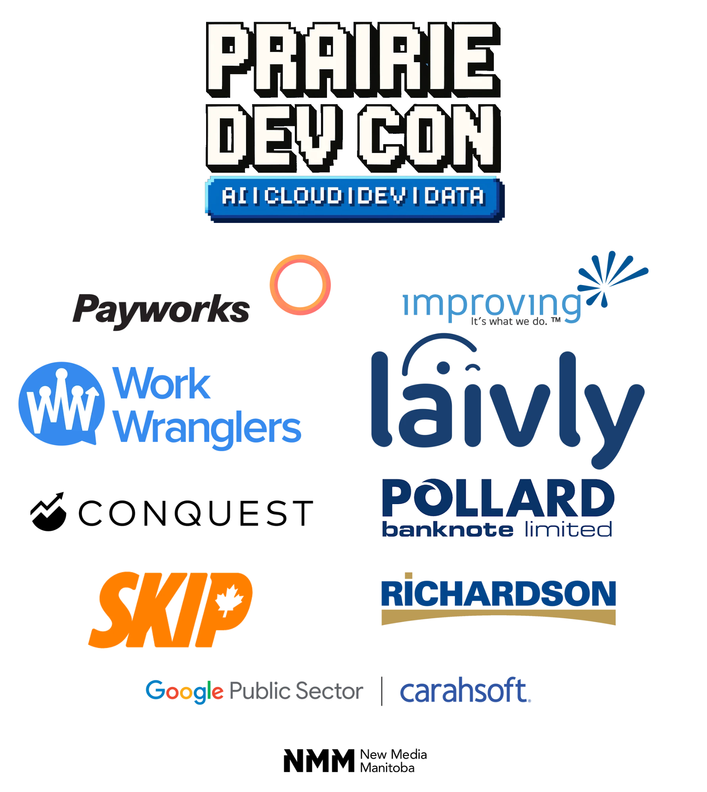

# Speed vs. Accuracy

## Execution Modes for Agentic Workflows

Hah, so that didn't survive the last 6 months! Turns out you can now make 
harnesses good enough that different modes are unnecessary. 

So now it's speed AND accuracy- even better. Join me as we explore what
people actually mean when they say "context management" or "let the model
explore". 

**Addison Rennick** — Principal Developer
Building agentic AI systems that automate real browser workflows at scale

> Everything you're about to see runs live, in this browser, from the same
> codebase.
